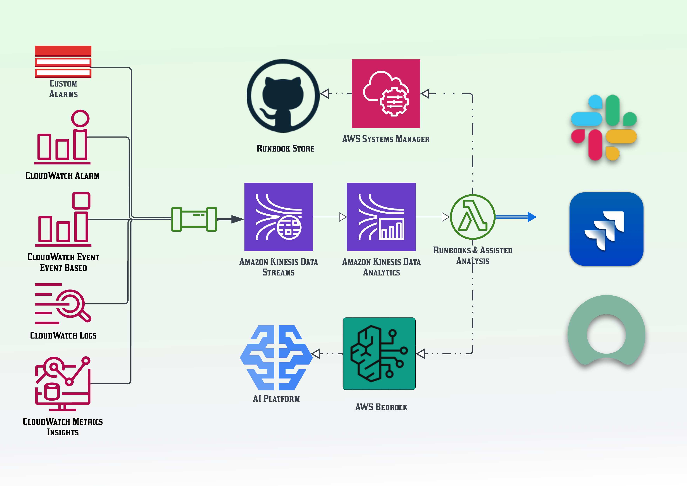

**Status: [DRAFT]**

### Table of contents
1. [Introduction](#introduction)
    1. [What is Generative AI] (#what-is-generative-ai)
2. [Smart Workload Insights](#smart-workload-insights)

--------------------------------------------------------

## Introduction
The DevOps cycle represents a set of practices and processes that facilitate continuous delivery and integration 
of software, ensuring efficiency and reliability in development and operations. In its purest form, it has eight 
key phases: **Plan**, **Code**, **Build**, **Test**, **Release**, **Deploy**, **Operate**, and **Monitor**. 
This continuous loop ensures efficient and reliable software development and operations. Every iteration begins 
with preparations and planning to define objectives and requirements, followed by coding and building the software. 
The new versions are then tested rigorously to ensure quality before the software is released and deployed to production. 
Once deployed, the software is operated and continuously monitored to maintain performance and address any issues or unexpected failures.
This iterative process promotes agility, collaboration, and rapid delivery of high-quality software systems.

In recent years, a significant amount of research and development has been focused on defining methodologies, team topologies, 
and enterprise integration patterns to ensure successful execution of the DevOps cycle within product teams. These teams are typically 
composed of numerous small groups, each contributing to one or more of the phases, ensuring a seamless transition between issues and responses 
throughout the project lifecycle.

### What is Generative AI
Historically, AI was used to understand and recommend information. Now, generative AI can also help us create new content. 
Generative AI refers to deep-learning models that can generate high-quality text, code, images, and other content based on 
the data they were trained on. Generative AI builds on existing technologies, like large language models (LLMs) which are 
trained on large amounts of text and learn to predict the next word in a sentence. For example, "peanut butter and ___" is 
more likely to be followed by "jelly" than "shoelace".

Introducing Generative AI to your DevOps cycle can offer several benefits and further enhancements to your process. 
Starting from where it ends, in the Monitoring phase, your events, service logs and alerts could be analysed to monitor performance, 
detect anomalies, and report potential issues before they become critical. In the same sense, there are lots of AI powered services 
to assist your team during the Planning & Coding phases; for example if your change management system is integrated with these tools, 
they will be able to read, understand and propose possible changes/ solutions to the raised issues inside tickets. The assisted coding 
experience is also another valuable resource which could help patching and fixing bugs at production faster. In Build & Test phase, 
generative AI or trained models can automate and enhance testing procedures to provide higher accuracy and faster feedback loops. 
Furthermore, your CICD pipeline should rely on autonamous agents to review release candidates and bridge the gap between the release and 
deployment time. 

## Intelligence from Workload Insights

In today's dynamic IT environments, monitoring your logs and events is a crucial step for maintaining system health and ensuring smooth operations. A guided and AI-driven flow can enhance your monitoring capabilities to analyse errors, extrapolate patterns, and automate the process of responding to potential bugs. In this post, I will use a simplified and high level model of an application, to demonstrate how you can accomplish this idea in your platform. I will provide some context, an overview of the abstract stages in the process and will share some implementation hints to highlight the key points of the process.

#### Overview
The process involves four key component:
1. **Operate**: Collecting and aggregating logs, traces, alerts, events etc.
2. **Monitor**: Streaming data for real-time analysis.
3. **Analyze**: Utilizing AI to detect anomalies and perform assisted analysis.
4. **Automate**: Executing guided responses based on predefined runbooks and generative AI.

#### Components

1. **Data Sources**:
   - **CloudWatch Alarms**: Set custom alarms for specific metrics.
   - **CloudWatch Event (Event Based)**: Capture specific events from AWS services.
   - **CloudWatch Logs**: Centralize and monitor log files.
   - **CloudWatch Metrics Insights**: Gather insights from various metrics.

2. **Data Streaming**:
   - **Amazon Kinesis Data Streams**: Capture, process, and analyze real-time streaming data.
   - **Amazon Kinesis Data Analytics**: Perform real-time analytics on streaming data.

3. **AI Integration**:
   - **AI Platform**: Utilize machine learning models and algorithms to detect anomalies.
   - **AWS Bedrock**: Enhance AI capabilities with pre-trained models and custom solutions.

4. **Automation and Response**:
   - **Runbook Store (GitHub)**: Store and manage automation scripts and runbooks.
   - **AWS Systems Manager**: Execute runbooks and manage automation tasks.
   - **Integration Tools**: Use tools like Slack and JIRA for notifications and ticket management.

#### Implementation Steps

1. **Set Up Data Sources**:
   - Configure CloudWatch Alarms for critical metrics.
   - Set up CloudWatch Event rules to capture important events.
   - Enable CloudWatch Logs to centralize and manage log files.
   - Use CloudWatch Metrics Insights to derive actionable insights from collected metrics.

2. **Stream Data with Amazon Kinesis**:
   - Create Kinesis Data Streams to capture real-time data from CloudWatch.
   - Set up Kinesis Data Analytics to analyze the streaming data in real time.

3. **Integrate AI for Analysis**:
   - Deploy an AI platform to analyze the data streams for anomalies.
   - Use AWS Bedrock to integrate advanced machine learning models for more accurate detection.

4. **Automate Responses with Runbooks**:
   - Store your automation scripts and runbooks in a GitHub repository.
   - Configure AWS Systems Manager to execute runbooks based on AI analysis results.
   - Integrate with Slack for real-time notifications and JIRA for automated ticket creation and management.

#### Example Use Case

Let's consider a scenario where your server logs indicate a spike in error rates. The system would:

1. **Detect the Spike**: CloudWatch Logs and Alarms capture the increase in error rates.
2. **Stream the Data**: Data is streamed to Amazon Kinesis for real-time processing.
3. **Analyze with AI**: AI models identify the spike as a potential issue.
4. **Trigger Automation**: A runbook stored in GitHub is executed via AWS Systems Manager to restart the affected service and notify the relevant team through Slack and create a JIRA ticket for tracking.
