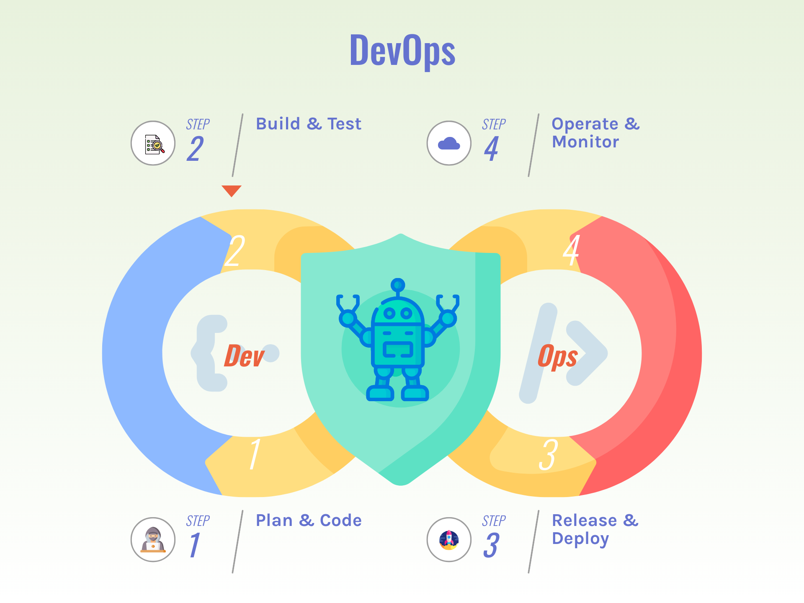

## Introduction
The DevOps cycle represents a set of practices and processes that facilitate continuous delivery and integration 
of software, ensuring efficiency and reliability in development and operations. In its purest form, it has eight 
key phases: **Plan**, **Code**, **Build**, **Test**, **Release**, **Deploy**, **Operate**, and **Monitor**. 
This continuous loop ensures efficient and reliable software development and operations. Every iteration begins 
with preparations and planning to define objectives and requirements, followed by coding and building the software. 
The new versions are then tested rigorously to ensure quality before the software is released and deployed to production. 
Once deployed, the software is operated and continuously monitored to maintain performance and address any issues or unexpected failures.
This iterative process promotes agility, collaboration, and rapid delivery of high-quality software systems.

In recent years, a significant amount of research and development has focused on defining methodologies, team topologies, 
and enterprise integration patterns to ensure successful execution of the DevOps cycle within product teams. These teams are typically 
composed of numerous small groups, each contributing to one or more of the phases, ensuring a seamless transition between issues and responses 
throughout the project lifecycle.

Introducing an AI-assisted component into this cycle can further enhance efficiency and effectiveness. 
Starting from the Monitor phase, AI can analyze vast amounts of operational data to identify patterns and predict potential issues before they occur. 
In the Plan phase, AI can assist in forecasting project timelines and resource allocation. During the Code and Build phases, AI can suggest code 
improvements, detect anomalies, and optimize build processes. In the Test phase, AI can automate and enhance testing procedures, ensuring higher 
accuracy and faster feedback loops. As the cycle progresses to the Release and Deploy phases, AI can streamline release management and deployment 
automation, reducing downtime and ensuring a smooth transition to production. This integration of AI into the DevOps cycle promises to 
revolutionize the way teams operate, driving innovation and improving overall project outcomes.