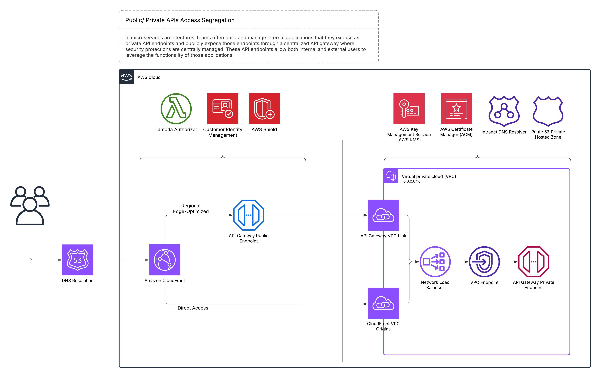

# 1. Introduction

If you've ever built APIs at an enterprise scale, you know defining the access boundaries of your public or private endpoints for security and compliance purposes can quickly become complex and hard to manage. Today, most Cloud developers are somehow involved in the process of developing and publishing APIs; and they often struggle to make a good trade-off between security, scalability, ease of development and maintainability of their products. I've faced these challenges too, and over time, I have built up a mental model of it that led me to design a solution for effectively managing public and private APIs.

# 2. Existing Approaches

Several solutions exist to handle API integration, but they each come with their limitations:

- This blog post explains how building private connections between  customer's VPC  and the vendors'  VPC network can help provide them with a secure access to the vendor's services. Although quite useful in terms of applications for VPC PrivateLink, these setups typically lack straightforward management for public APIs with **global distribution**.
- [https://www.serverlessguru.com/blog/private-serverless-rest-api-with-api-gateway-lambda-dynamodb-vpc-endpoints-terraform---part-2](https://www.serverlessguru.com/blog/private-serverless-rest-api-with-api-gateway-lambda-dynamodb-vpc-endpoints-terraform---part-2)
- This post is interesting and unique because it utilises the VPC Lattice intergation with Lambda to create a secure HTTP channel for a  VPC network. This works well for specific scenarios, like mediating interactions with legacy systems, but isn't comprehensive enough for broader API management needs. AWS VPC Lattice is valuable in niche cases, especially with legacy apps, but doesn’t fully meet the needs of enterprises looking for comprehensive API management solutions.
- [https://aws.amazon.com/blogs/compute/building-private-serverless-apis-with-aws-lambda-and-amazon-vpc-lattice ](https://aws.amazon.com/blogs/compute/building-private-serverless-apis-with-aws-lambda-and-amazon-vpc-lattice )

All above idea are useful, but they don’t fully address central management or seamless integration of security practices. The following sections will take you through aspects of the problem we are trying to solve, it gives you a brief list of AWS cloud resources I've used for the Proof of Concept, and finally it will discuss the cross functional requirements that could be addressed using this approach.


# 3. Yet antoher way to properly Segregate your private public endpoints

What I'm proposing  as a solution in this post is more like a topology recipe for a few of AWS Services that are involved in packaging and hosting your APIs endpoints. It effectively separates public and private APIs while creating a centralized facility to apply security and management policies at global scale:

- **Public API Gateway:** Handles public endpoints and global access efficiently.
- **CloudFront CDN:** Improves global reach and performance.
- **Lambda Authorizer & AWS Shield:** Robust authentication and protection.
- **VPC Link:** Secures internal communications within your infrastructure.
- **Network Load Balancer (NLB) & VPC Endpoint:** Ensures private APIs stay within a secure network boundary.
- **Private API Gateway Endpoint:** Keeps private APIs inaccessible from the outside.

## 3.1 Implementation Example

Here's an example configuration snippet demonstrating how to provision and set up public and private endpoints using SST (v3) framework:

```javascript
// Private API Setup
const privateApi = new sst.aws.ApiGatewayV1('private-api-sample', {
  endpoint: {
    type: 'private',
    vpcEndpointIds: [vpcEndpoint.id],
  },
});

privateApi.route('GET /', {
  handler: 'index.latest',
});

// Public API Setup
const publicApi = new sst.aws.ApiGatewayV1("public-api-sample");

publicApi.route("GET /public/path", {
  handler: 'src/get.handler'
});
```

What it tells us is that on a one hand you'll have your development team constantly publishing APIs to your runtime environment, either adding better versions of the existing APIs or introducing new ones, and on the other hand you have one or more personas that you have promised to your customers that a. it would be available to them most of the time (99.999%) and b.that it would handle their requests reliably and efficiently.

Having been part of many development teams, it is evident to me that the above two activities are not entirely compatible with each other. One requires a certain level of reliability so that your clientele can count on the services that they are purchasing from you and the other one requires a lot of innovation and experimentation. And hence if we leave them to organically adapt to the conditions of each other, we might put ourselves at the risk of breaching our SLAs on either side. 

## 3.2 Overview of the solution
	
CloudFront & API Gateway provide a global, scalable way to selectively expose and manage the public APIs while keeping private ones secure and out of reach from the public space. 



