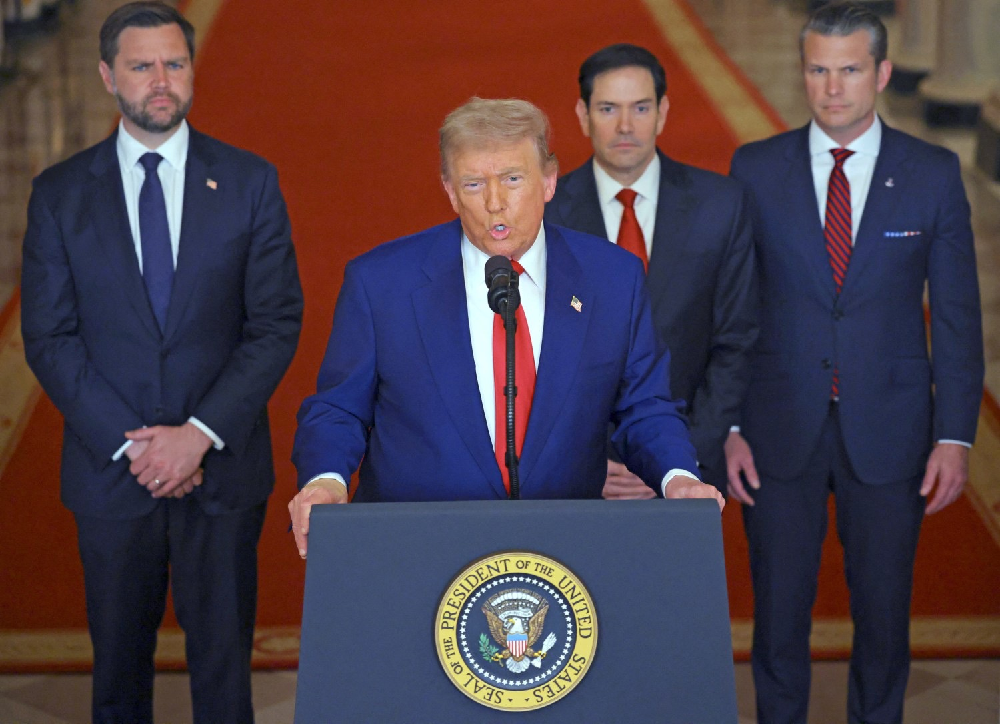

### Introduction

>Donald Trump’s re-emergence isn’t an aberration, but rather a consequence. His recent foreign policy posturing and nationalist rhetoric reflect a deeper, systemic failure which stems from the erosion of democratic vigilance, both among political elites and the general public. When citizens are demoralised and disengaged, institutions can easily normalise extremism; and once that's done, the door is left wide open for banality to breed danger — again!

In a world unraveling at its seams, where civilians are shot dead for queuing up for bread in Gaza and entire cities in Ukraine are flattened under the illusion of ceasefire diplomacy, one man still believes that image is strategy.

Donald Trump’s recent proclamations on “ending all wars” sound less like statesmanship and more like campaign-season engineering to manipulate the masses with statements that are stripped of empathy and complexity, and actions that are devoid of any grasp of realpolitik. In Gaza, starvation is being used as a silent weapon for bargain [July 2025]. In Ukraine, peace can’t be dictated by someone who refuses to understand that Putin’s war machine won’t stop until it extracts a symbolic — if not territorial — victory [2022...2025...~]. Trump, meanwhile, calls for superficial ceasefires as if ceasefires were just another clause in a real estate contract.

But this moment isn’t just about him; he is a symptom of a deeper issue our society is grappling with. It’s about what we’ve normalised. In Mein Kampf, Hitler lays out a blueprint: inflate national pride, create an “us vs them,” promise restoration of greatness, and rally the disillusioned behind a single enemy. America heard echoes of that in “Make America Great Again” and “America First” — hooks that are steeped in nostalgia and built on the backs of immigrants, minorities, and outsiders. When you strip the historical context away, nationalism always sounds noble. But history has warned us many times that it rarely ends that way.

### A Story We’ve Seen Before

>The American economy is groaning under the weight of its own contradictions. Public debt has ballooned far beyond projections, and a storm is quietly forming on the economic horizon. But if you ask Donald Trump, everything’s fine — just blame the immigrants, start another war, and demand Europe spend more on tanks. Problem solved. What passes for strategy in Trump’s world is little more than misdirection at its core; a transparent attempt to distract from looming financial catastrophe. The debt crisis isn’t just fiscal — it’s ideological. Rather than confront the unsustainable trajectory of tax cuts, endless subsidies for the ultra-wealthy, and a hollowed-out middle class, Trump has chosen the oldest political trick in the book: create enemies.

So, he turns outward. Calls for NATO countries to boost their military budgets [May 2025] echo across his speeches — not because of some newfound strategic foresight, but because war sells. Defense spending props up an economy addicted to short-term adrenaline, not long-term health. If America is broke, then let the world pay the bill. The transatlantic alliance is no longer a partnership — it’s a marketplace. He turns inward too. The economic fallout? Blame it on immigration. Supply chain issues, inflation, job losses — all dumped at the feet of desperate people crossing borders [April 2025]. Trump’s rhetoric doesn’t just dehumanize immigrants, it scapegoats them to cover his own administration’s economic incompetence. It’s the kind of convenient cruelty that feels like a solution until you realize your rent’s still rising.

And then there’s foreign policy — or rather, foreign posturing. The recent bombing of Iran [June 2025]? Loud, dramatic, but ultimately hollow. There was no strategy, no measurable outcome, no long-term objective. Just another hit-and-run operation designed to grab headlines and stoke nationalism. It was a move straight out of The Big Short — gamble hard, make it loud, and pray no one looks at the numbers. Meanwhile, Gaza bleeds. Civilians are killed asking for food. Starvation is used as leverage, and Trump offers no meaningful leadership — just vague declarations and political gymnastics. The same goes for Ukraine, where his incoherent remarks during Zelensky’s visit to the White House [Feb 2025] reinforced what many already feared: he neither understands nor cares about the implications of abandoning Eastern Europe to Russian imperialism. It’s not diplomacy. It’s disinterest in disguise.

Even the “Big Beautiful Wall” [January 2018] — that concrete metaphor for oversimplified solutions — is still being paraded like a victory, despite failing to stop anything but reasoned discourse. And tariffs? Back on the table, as if taxing your way out of a recession has ever worked without consequences.

>In the face of rising debt and a looming downturn, Trump isn’t offering policy. He’s offering theater — explosive, divisive, and dangerously effective. It’s the politics of distraction: keep the people angry, keep the markets guessing, and keep the blame flowing anywhere but up.

### The Soft Soil Where Authoritarianism Grows
>Like evil authoritarianism takes many forms; it doesn’t need a marching band, nor does it need to arrive in jackboots or behind tanks. Sometimes it wears a suit, cracks a joke, and promises to ‘_get things done — sometimes in two weeks!_‘. But it only takes root when the ground is fertile — and that ground is us!

Over the past decade, I’ve seen a slow erosion of civic vigilance. This is not something that would happen by accident, rather it is fueled by the shadows of negligence and sustained via an astonishing lack of discernment. It looks like this:

- **Shrugging at the news** Another scandal, another outrageous quote, another executive power grab; and yet, we scroll past it as if it's just noise. Our capacity for outrage has been numbed by volume.
- **Equating complexity with bias** When everything nuanced is labeled “political” or “woke,” we retreat into the comfort of one-liners and memes. We start treating critical thinking as exhausting, and settle for simple statements and certainty — even when it’s wrong. But _reality_ is not something that could be summarised in a collection of simple facts.
- **False equivalence** “All politicians are the same.” “Both sides are corrupt.” That kind of lazy cynicism pretends to be wise, but it’s just an excuse to disengage. There’s a difference between flawed governance and outright destabilization.
- **Performative politics** Sharing a hashtag, posting a black square, performing outrage online — but never showing up offline. Not voting. Not reading. Not talking. Not holding anyone accountable
- **Worshiping disruption as a virtue** Somewhere along the line, we started mistaking chaos for courage and greatness. If someone “shakes things up,” we cheer and make loud noise even when what they’re shaking are the very institutions meant to prevent dictatorship. 

>These are the behaviors that allowed Trump and figures like him across the globe to rise, fall, and rise again. Not because they were strong, but because we got tired. And tired democracies are susceptible to infections from those who want to take over and control the majority.

The institutions didn’t fail us overnight. They cracked slowly, under the pressure of performative neutrality, profit-driven media, and our collective choice to look away. We don’t lose democracies overnight. We wear them down with fatigue, reduce them to hashtags, and then act surprised when something darker steps in. We laughed when we should have listened. We moved on when we should have dug in.

### The Warning in Plain Sight

>This isn’t about Donald Trump — not anymore. He is what happens when a democracy starts outsourcing its memory, its outrage, and its moral responsibility. He is a consequence, not a cause.

We’ve seen this story before: rising debt, shrinking empathy, manufactured enemies, and a populace too overwhelmed or too comfortable to care. It’s not that evil hides — it’s that we stop recognizing it when it smiles, when it waves a flag, when it promises to restore what was never truly lost.

History doesn’t always announce itself. Sometimes it walks in the front door while we’re refreshing the news feed. And by the time we’re ready to respond, the damage is already done — not because we were tricked, but because we were tired.

>“The sad truth,” Arendt once wrote, “is that most evil is done by people who never make up their minds to be either good or evil.”

If that sounds familiar, it should. We are living through the sequel, and once again, the audience is asleep! I hope you enjoyed reading this piece, it was born out of an urge to express my thoughts & concerns about the world's current affairs.        

------------------------------------------------
