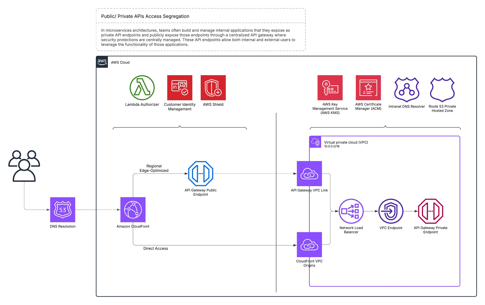

>Donald Trump’s re-emergence isn’t an aberration, but rather a consequence. His recent foreign policy posturing and nationalist rhetoric reflect a deeper, systemic failure which stems from the erosion of democratic vigilance, both among political elites and the general public. When citizens are demoralised and disengaged, institutions can easily normalise extremism; and once it is done the door is left wide open for banality to breed danger — again.

### Introduction

In a world unraveling at its seams, where civilians are shot dead for queuing up for bread in Gaza and the entire cities in Ukraine are flattened under the illusion of ceasefire diplomacy, one man still believes that performative posturing is a strategy.

Donald Trump’s recent proclamations on “ending all wars” sound less like statesmanship and more like campaign-season engineering to manipulate the masses with statements that are stripped of empathy and complexity, and actions that are devoid of any grasp of realpolitik. In Gaza, starvation is being used as a silent weapon for bargain. In Ukraine, peace can’t be dictated by someone who refuses to understand that Putin’s war machine won’t stop until it extracts a symbolic — if not territorial — victory. Trump, meanwhile, calls for superficial ceasefires as if wars are just business deals waiting to be closed.

But this moment isn’t just about him; he is a symptom of a deeper issue our society is grappling with. It’s about what we’ve normalised. In Mein Kampf, Hitler lays out a blueprint: inflate national pride, create an “us vs them,” promise restoration of greatness, and rally the disillusioned behind a single enemy. America heard echoes of that in “Make America Great Again” and “America First” — hooks that are steeped in nostalgia and built on the backs of immigrants, minorities, and outsiders. When you strip the historical context away, nationalism always sounds noble. But history has warned us many times that it rarely ends that way.

