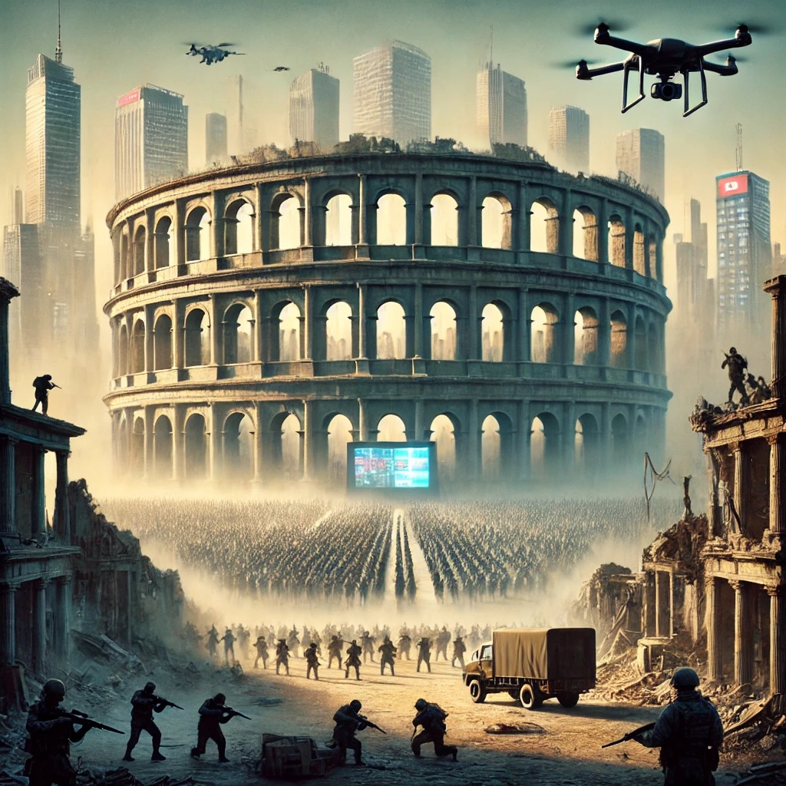

---

## Introduction
In a world where humanity has made staggering advancements in technology, science, and social understanding, the persistence of full-scale wars remains a stark and troubling paradox. Despite our progress, we continue to engage in conflicts that lead to widespread destruction, loss of life, and long-lasting devastation. This raises fundamental questions about the deep-seated forces that drive these modern conflicts, forces that seem to echo ancient practices like gladiator fights and primal instincts rooted in our evolutionary past.

## The Staggering Paradox of Modern Warfare
It is indeed staggering that despite all our advancements, humanity continues to engage in full-scale wars. These wars result in widespread destruction, the devastation of infrastructure, and leave entire societies in a state of collapse. This reality serves as a stark reminder that progress in one area, such as technology or science, does not necessarily translate into progress in human behavior or societal structures.

Adding to the paradox is the fact that much of the world often remains silent, watching wars unfold between two or multiple parties without significant intervention. This inaction is eerily reminiscent of ancient gladiator fights, where spectators would watch brutal battles to the death. In modern times, the global community often stands by as conflicts rage on, driven by geopolitical interests, fear of escalation, or the sheer complexity of the situation.

In a modern-day battlefield, where advanced technology and infrastructure intertwine with chaos and destruction, one can't help but notice the echoes of those ancient arenas. Soldiers engage in brutal combat, surrounded by destroyed cities, while distant spectators, now in the form of an indifferent global audience, watch as the destruction unfolds. The landscape is marked by both the remnants of ancient brutality and the cold precision of modern warfare, where advanced weaponry and digital screens silently document the chaos.

## Wars Driven by Elites, Fought by Strangers
A stark reality of modern warfare is that it is often orchestrated by an elite few, serving their desires and interests, while the actual fighting is done by ordinary people who rarely know each other. These conflicts are initiated by those in power—politicians, military leaders, and influential figures—who are often far removed from the front lines. Meanwhile, the soldiers who carry out their orders are typically young men and women from diverse backgrounds, brought together not by personal enmity but by the directives of a distant authority.

This detachment is further exacerbated by modern warfare tactics, where technology allows combat to occur at a distance. Drones, long-range missiles, and automated systems enable soldiers to kill without ever seeing their enemy, reducing war to a remote and impersonal act. The lack of close encounters not only depersonalizes the conflict but also insulates those who lead the wars from the human cost of their decisions.

This phenomenon finds a disturbing parallel in the digital world, where social platforms and mass media have become battlegrounds of influence and control. Just as wars are led by elites, so too are online conflicts often driven by powerful entities—corporations, political groups, or influencers—while the public becomes the unwitting participants, engaging in battles of words, ideas, and misinformation. In both arenas, those at the top manipulate the masses to serve their own interests, often leading to widespread division, hostility, and social fragmentation.

## Can We Redirect Our Primal Instincts?
If we assume that we cannot fundamentally change the primal evolutionary instincts that drive much of what happens in the world, the question then becomes: can we guide this energy in ways that are less harmful, brutal, and devastating? Can we channel the inherent drive to compete, exert influence, and strive for survival into frameworks that allow for progress without destruction?

One way to explore this idea is through the lens of game design and systems thinking. If war is viewed as a kind of game framework—a multi-agent system where different actors compete under certain rules—then it stands to reason that we could design alternative "games" where the rules are less destructive. Take, for example, the concept of blockchain technology, where participants burn energy to solve complex problems and compete to complete a block in the chain. This competition is fierce, driven by the desire for reward, but it doesn’t result in loss of life or the destruction of communities. 

Similarly, we could look at the world of competitive sports, where the primal instincts for dominance, strategy, and physical prowess are channeled into highly structured, rule-bound activities. These sports can be intense and highly competitive, yet they offer a way to channel aggressive instincts into activities that are socially acceptable and even celebrated, rather than destructive.

These examples suggest that it is possible to redirect our primal drives into frameworks that satisfy our need for competition and dominance while minimizing harm. By designing and promoting such frameworks, we can create spaces where the human drive for survival and progress is harnessed in ways that contribute to, rather than detract from, the collective well-being.

## Summary
The persistence of war in the modern era is a sobering reminder of the primal forces that continue to shape human behavior. As we move forward, it is crucial to acknowledge and address these deep-seated drives, seeking ways to channel them towards more constructive and peaceful resolutions. Only by understanding the roots of conflict and exploring alternative frameworks can we hope to transcend the cycle of violence and create a more harmonious world.

---
